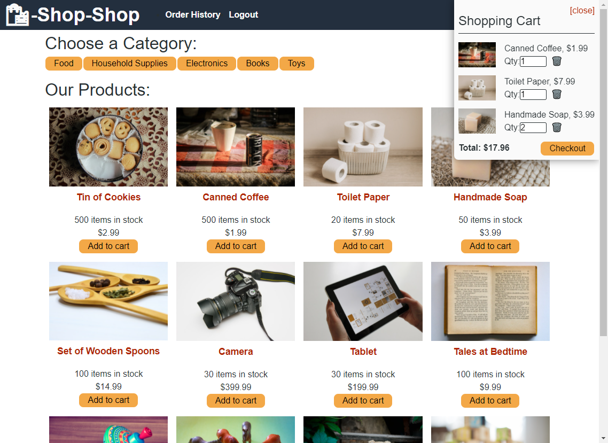

<h1 align="center">Redux Store</h1>
<h2 align="center">MERN Stack with Redux</h2>

## Description

This application refactors an existing E-Commerce application built on React's Context API into one leveraging Redux for global state management. Users are able to browse a limited collection of categorized demo products to construct their cart. Checkout is handled using the Stripe payment processing integration - operating in development mode. The application is deployed to Heroku and can be found here: [Redux Store](https://polar-sierra-41702.herokuapp.com/)

## Table of Contents

- [Usage](#usage)
- [License](#license)
- [How to Contribute](#how-to-contribute)
- [Questions](#questions)

## Usage

[Redux Store](https://polar-sierra-41702.herokuapp.com/)

Users are able to browse a collection of categorized products and add them to their cart. Additionally, users can either signup with a new account or login with an existing account. Once they are logged in, they have the option to checkout using the Stripe payment processing integration (development mode) to complete their order. There is also a page in which the user can view their order history.

## License

This application is covered under the MIT license. Information about this license can be found [here](http://choosealicense.com/licenses/mit/).

## How to Contribute

[MichaelHermes](https://github.com/MichaelHermes)

## Questions?

Find me on [Github](https://github.com/MichaelHermes) or email me at [mikehermes87@gmail.com](mailto:mikehermes87@gmail.com).
